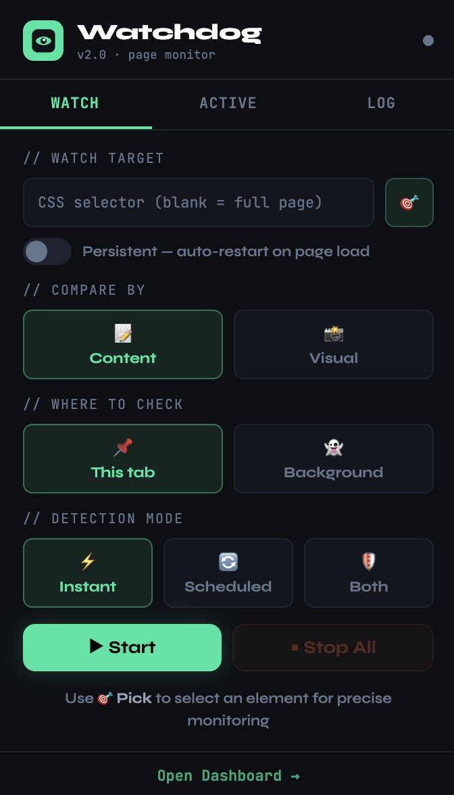

  

<h1 align="center">Watchdog</h1>

  A Chrome extension that monitors web pages for changes and notifies you instantly. 
  Point-and-click element selection, visual screenshot comparison, persistent watchers, and full change history — all running locally in your browser.

## Features

- **Element Picker** — Click any element on a page to start watching it. Shows human-readable labels so you know exactly what you're selecting.
- **Content & Visual Modes** — Track text/DOM changes or use pixel-level screenshot comparison for elements that render visually (canvas, iframes, images).
- **Multi-Watcher Support** — Watch multiple elements on different pages simultaneously.
- **Persistent Watchers** — Watchers auto-restore when you revisit a page, even after browser restart.
- **Change History** — View a timestamped log of every detected change per watcher.
- **Dashboard** — Full-page overview of all watchers, their status, and change history.
- **Desktop Notifications** — Get notified the moment something changes, with smart cooldowns to avoid spam.
- **Scheduled Checks** — Set polling intervals for elements that don't trigger DOM mutations.

## Screenshots

  

## Installation

### From source (developer mode)

1. Clone or download this repository
2. Open `chrome://extensions/` in Chrome
3. Enable **Developer mode** (top-right toggle)
4. Click **Load unpacked** and select the project folder
5. The Watchdog icon appears in your toolbar

## Usage

1. Navigate to any web page you want to monitor
2. Click the Watchdog icon in the toolbar
3. In the **Watch** tab, click **Pick Element** and click the element you want to track
4. Choose your settings:
   - **Content mode** — detects text and DOM changes via MutationObserver
   - **Visual mode** — captures screenshots and compares pixels (auto-selected for iframes)
   - **Scheduled checks** — set a polling interval (useful for dynamic content)
   - **Persistent** — toggle to auto-restore the watcher on future visits
5. Click **Start Watching**

Manage active watchers from the **Active** tab or open the **Dashboard** for a full overview.

## Architecture

| File | Role |
|------|------|
| `manifest.json` | Extension config (MV3) |
| `background.js` | Service worker — storage, alarms, notifications, message routing |
| `content.js` | Injected on all pages — DOM observation, element picking, watcher lifecycle |
| `popup.js` | Popup UI — Watch/Active/Log tabs |
| `dashboard.js` | Full-page dashboard UI |
| `offscreen.js` | Canvas-based image cropping and pixel-diff for visual mode |

## Permissions

| Permission | Why |
|------------|-----|
| `storage` | Persist watcher configs and change history locally |
| `notifications` | Desktop alerts when changes are detected |
| `activeTab` | Access the current tab for element picking |
| `scripting` | Inject content script for element selection |
| `alarms` | Schedule periodic checks |
| `tabs` | Activate tabs for visual screenshot capture |
| `offscreen` | Off-screen canvas for image processing |
| `<all_urls>` | Watch elements on any website |

All data stays local. No external servers, no analytics, no tracking.

## License

MIT
